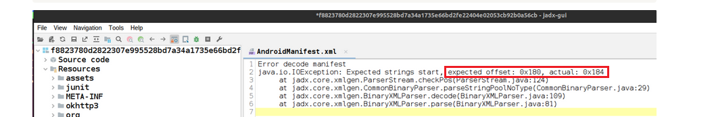

<h1>Contents</h1>

[APK anti-analysis methods used](#apk-anti-analysis-methods)
 
  [1. Wrong ZIP header data values](#wrong-zip-header-values)
 
  [2. Wrong values in the manifest structure](#wrong-values-manifest)
 
  [2.1. Magic value](#magic-value)
 
  [2.2. Array of strings' offsets](#array-strings-offsets)
 
  [2.3. Style pool](#style-pool)
 
  [3. Long filenames](#long-filenames)
 
  [Signature recommendations](#signature-recommendations)
 
 

<h2><a class="a-dummy" name="apk-anti-analysis-methods">APK anti-analysis methods used</a></h2>
Techniques in this group abuse the values in specific structures, which are crucial for APK analysis. These evasions are actually possible because of the differences in how the Android launcher treats them and how the analysis tools approach the same data. While the main responsibility of the launcher is to execute an application and perform only basic sanity checks, analysis tools strive to provide as much information as possible about an APK. If some logic discrepancies are encountered during the process of analysis, the tool fails, thus showing the presence of an anti-analysis trick.

 
<h3><a class="a-dummy" name="wrong-zip-header-values">1. Wrong ZIP header data values</a></h3>

The clue about something strange inside the APK archive (which should be a usual ZIP archive) is seen in the message shown by JEB Pro:

  

 

APK is usually not split into multi-disk archives, so this information has to be checked inside - by analyzing the ZIP header data. The necessary entry is the <u>central directory file header</u>. The end of this record <a href="https://docs.fileformat.com/compression/zip/#end-of-central-directory-record">EOCD</a> contains information about disk count at offsets 4 and 6. We will also pay attention to the offsets 10 and 12, as explained below.

<b>EOCD fields</b>

<table style="width:100%">
  <tr>
  	<th style="text-align:center">Offset</th>
  	<th style="text-align:center">Bytes</th>
  	<th style="text-align:center">Description</th>
  </tr>
  <tr>
  	<td>0</td>
  	<td>4</td>
  	<td>End of central directory signature = 0x06054b50</td>
  </tr>
  <tr>
  	<th>4</th>
  	<th>2</th>
  	<th>Number of this disk (or 0xffff for ZIP64)</th>
  </tr>
  <tr>
  	<th>6</th>
  	<th>2</th>
  	<th>Disk where central directory starts (or 0xffff for ZIP64)</th>
  </tr>
  <tr>
  	<td>8</td>
  	<td>2</td>
  	<td>Number of central directory records on this disk (or 0xffff for ZIP64)</td>
  </tr>
  <tr>
  	<th>10</th>
  	<th>2</th>
  	<th>Total number of central directory records (or 0xffff for ZIP64)</th>
  </tr>
  <tr>
  	<th>12</th>
  	<th>4</th>
  	<th>Size of central directory (bytes) (or 0xffffffff for ZIP64)</th>
  </tr>
  <tr>
  	<td>16</td>
  	<td>4</td>
  	<td>Offset of start of central directory, relative to start of archive (or 0xffffffff for ZIP64)</td>
  </tr>
  <tr>
  	<td>20</td>
  	<td>2</td>
  	<td>Comment length (n)</td>
  </tr>
  <tr>
  	<td>22</td>
  	<td>n</td>
  	<td>Comment</td>
  </tr>
</table>

EOCD marks the end of ZIP so the required byte sequence can be found at the end of the file:

  

 

The processed struct, along with fixes (explained below), looks like this:

  

 

Based on the very large values in the disk number fields, it is clear that the malware developers edited these fields and entries. If to compare this APK with any other legitimate APKs, it will be seen that in these APKs, values <b>elDiskNumber</b> and <b>elStartDiskNumber</b> are equal to 0. And in the current case the disk numbers should be set to 0 as well.

Also, the values <b>elEntriesInDirectory</b> and <b>elDirectorySize</b> are the same in legitimate APKs as opposed to the target one. As <b>elEntriesInDirectory</b> has <b><i>ushort</i></b> type (2 bytes long), its maximum value is 65536 – and can’t be equal to 139122 which is set in elDirectorySize. It means that the value of <b>elDirectorySize</b> must be equal to the value of <b>elEntriesInDirectory</b>, not vice versa, i.e., we set the value of <b>elDirectorySize</b> to 1075. This number corresponds to the files inside the APK, i.e. ZIP archive, but we could not know about it before the fix was done indeed.

 
<h3><a class="a-dummy" name="wrong-values-manifest">2. Wrong values in the manifest structure</a></h3>

 
<h4><a class="a-dummy" name="magic-value">2.1. Magic value</a></h4>

The AndroidManifest file must start with specific magic numbers (<tt>0x00080003</tt> or <tt>0x00080001</tt>) as expected by APKTool:

  

 

However, upon closer examination of this apktool <a href="https://github.com/iBotPeaches/Apktool/issues/1976">issue</a>, it appears that the only correct value in AndroidManifest header is <tt>0x00080003</tt>, which is equal to the constant name <tt>CHUNK_AXML_FILE</tt> in the apktool <a href="https://github.com/iBotPeaches/Apktool/blob/master/brut.apktool/apktool-lib/src/main/java/brut/androlib/res/decoder/AXmlResourceParser.java#L986">source code</a>, not <tt>CHUNK_AXML_FILE_BROKEN</tt> which stands for <tt>0x00080001</tt>.

  

 

And the analyzed file starts with <tt>0x00080000</tt>. By changing it to the correct value, this issue becomes mitigated.

 
<h4><a class="a-dummy" name="array-strings-offsets">2.2. Array of strings' offsets</a></h4>

Another trick to fool analysis tools lies in the incorrent offset in the array of string offsets:

  

 

To analyze what causes this exception, we first make a breakdown of <tt>AndroidManifest</tt> structure:

  

 

By checking the offset shown in the exception, we understand that the issue is in the <b>scStringOffsets</b> array field, in its last element (0x24 + 0x160 = 0x184 – the exact offset shown in the exception).
When examining this array closely, we see that the offset of the last string is pointing out of the file.

  

 

The string “theme” is wrongly interpreted as an offset value in the last element of the array, number 87. This means that the value of the <b>scStringCount</b> should be less by 1, i.e., set to 86. Now there are 87 elements in the array, all of 4 bytes, multiplication of 87*4 is equal to 348, which is 0x15C in hex. As <b>scStringOffsets</b> fields starts at 0x24, now it ends at 0x24+0x15C, which is equal to 0x180 – exactly what is expected in the analysis tool.

 
<h4><a class="a-dummy" name="style-pool">2.3. Style pool</a></h4>

In this trick, the value of the <b>scStylePoolOffset</b> field points out from the actual <tt>AndroidManifest</tt> file. Based on the <b>scStyleCount</b> field (equal to 0), it is a logical assumption that the file shouldn't contain "styles”, and the value of this field should be 0 as well.

  

 

 
<h3><a class="a-dummy" name="long-filenames">3. Long filenames</a></h3>

This technique is related to the files inside the APK. Developers added a large number of files inside nested directories to the asset folder. As a result, the length of the file name and path is over 300 characters.

These files break the logic of tools that cannot remap file locations and may fail during APK decompilation – like <i>apktool</i>. After analyzing the API calls from bytecode, we can see that there are no actual references to these files. It means that such files can be manually removed from the APK as they are not required anymore.

 
<h3><a class="a-dummy" name="signature-recommendations">Signature recommendations</a></h3>

<i>No signature recommendations are provided for this evasion group, as the techniques are speaking for themselves. If analysis tools fail to process a sample with some errors shown, it's likely a sign of a used anti-analysis trick.</i>
