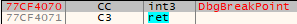

<h1>Contents</h1>

[Process Memory](#process-memory)

* [1. Breakpoints](#breakpoints)
    * [1.1. Software Breakpoints (INT3)](#software-breakpoints)
    * [1.2. Anti-Step-Over](#anti-step-over)
        * [1.2.1. Direct Memory Modification](#direct-memory-modification)
        * [1.2.2. ReadFile()](#readfile)
        * [1.2.3. WriteProcessMemory()](#writeprocessmemory)
        * [1.2.4. Toolhelp32ReadProcessMemory()](#toolhelp32readprocessmemory)
    * [1.3. Memory Breakpoints](#memory-breakpoints)
    * [1.4. Hardware Breakpoints](#hardware-breakpoints)
* [2. Other memory checks](#other-memory-checks)
    * [2.1. NtQueryVirtualMemory()](#ntqueryvirtualmemory)
    * [2.2. Detecting a function patch](#detecting-a-function-patch)
    * [2.3. Patch ntdll!DbgBreakPoint()](#patch_ntdll_dbgbreakpoint)
    * [2.4. Patch ntdll!DbgUiRemoteBreakin()](#patch_ntdll_dbguiremotebreakin)
    * [2.5  Performing Code Checksums](#code-checksums)
* [Mitigations](#mitigations)
 

<h2><a class="a-dummy" name="process-memory">Process Memory</a></h2>
A process can examine its own memory to either detect the debugger presence or interfere with the debugger.

This section includes the process memory and examining the thread contexts, searching for breakpoints, and function patching as anti-attaching methods.

 
<h3><a class="a-dummy" name="breakpoints">1. Breakpoints</a></h3>
It is always possible to examine the process memory and search for software breakpoints in the code, or check the CPU debug registers to determine if hardware breakpoints are set.

 
<h4><a class="a-dummy" name="software-breakpoints">1.1. Software Breakpoints (INT3)</a></h4>
The idea is to identify the machine code of some functions for <tt>0xCC</tt> byte which stands for <tt>INT 3</tt> assembly instruction.

This method can generate many false-positive cases and should therefore be used with caution.

<b>C/C++ Code</b>



bool CheckForSpecificByte(BYTE cByte, PVOID pMemory, SIZE_T nMemorySize = 0)
{
    PBYTE pBytes = (PBYTE)pMemory; 
    for (SIZE_T i = 0; ; i++)
    {
        // Break on RET (0xC3) if we don't know the function's size
        if (((nMemorySize > 0) && (i >= nMemorySize)) ||
            ((nMemorySize == 0) && (pBytes[i] == 0xC3)))
            break;

        if (pBytes[i] == cByte)
            return true;
    }
    return false;
}

bool IsDebugged()
{
    PVOID functionsToCheck[] = {
        &Function1,
        &Function2,
        &Function3,
    };
    for (auto funcAddr : functionsToCheck)
    {
        if (CheckForSpecificByte(0xCC, funcAddr))
            return true;
    }
    return false;
}



 
<h4><a class="a-dummy" name="anti-step-over">1.2. Anti-Step-Over</a></h4>
Debuggers allow you to step over the function call. In such a case, the debugger implicitly sets a software breakpoint on the instruction which follows the call (i.e. the return address of the called function).

To detect if there was an attempt to step over the function,  we can examine the first byte of memory at the return address. If a software breakpoint (<tt>0xCC</tt>) is located at the return address, we can patch it with some other instruction (e.g. <tt>NOP</tt>). It will most likely break the code and crash the process. On the other hand, we can patch the return address with some meaningful code instead of <tt>NOP</tt> and change the control flow of the program.

<h5><a class="a-dummy" name="direct-memory-modification">1.2.1. Direct Memory Modification</a></h5>
It is possible to check from inside a function if there is a software breakpoint after the call of this function. We can read one byte at the return address and if the byte is equal to <tt>0xCC</tt> (<tt>INT 3</tt>), it can be rewritten by <tt>0x90</tt> (<tt>NOP</tt>). The process will probably crash because we damage the instruction at the return address. However, if you know which instruction follows the function call, you can rewrite the breakpoint with the first byte of this instruction.

<b>C/C++ Code</b>



#include <intrin.h>
#pragma intrinsic(_ReturnAddress)

void foo()
{
    // ...
    
    PVOID pRetAddress = _ReturnAddress();
    if (*(PBYTE)pRetAddress == 0xCC) // int 3
    {
        DWORD dwOldProtect;
        if (VirtualProtect(pRetAddress, 1, PAGE_EXECUTE_READWRITE, &dwOldProtect))
        {
            *(PBYTE)pRetAddress = 0x90; // nop
            VirtualProtect(pRetAddress, 1, dwOldProtect, &dwOldProtect);
        }
    }
    
    // ...
}



<h5><a class="a-dummy" name="readfile">1.2.2. ReadFile()</a></h5>
The method uses the <tt>kernel32!ReadFile()</tt> function to patch the code at the return address.

The idea is to read the executable file of the current process and pass the return address as the output buffer to <tt>kernel32!ReadFile()</tt>. The byte at the return address will be patched with <tt>'M'</tt> character (the first byte of PE image) and the process will probably crash.

<b>C/C++ Code</b>



#include <intrin.h>
#pragma intrinsic(_ReturnAddress)

void foo()
{
    // ...
    
    PVOID pRetAddress = _ReturnAddress();
    if (*(PBYTE)pRetAddress == 0xCC) // int 3
    {
        DWORD dwOldProtect, dwRead;
        CHAR szFilePath[MAX_PATH];
        HANDLE hFile;

        if (VirtualProtect(pRetAddress, 1, PAGE_EXECUTE_READWRITE, &dwOldProtect))
        {
            if (GetModuleFileNameA(NULL, szFilePath, MAX_PATH))
            {
                hFile = CreateFileA(szFilePath, GENERIC_READ, FILE_SHARE_READ, NULL, OPEN_EXISTING, 0, NULL);
                if (INVALID_HANDLE_VALUE != hFile)
                    ReadFile(hFile, pRetAddress, 1, &dwRead, NULL);
            }
            VirtualProtect(pRetAddress, 1, dwOldProtect, &dwOldProtect);
        }
    }
    
    // ...
}



<h5><a class="a-dummy" name="writeprocessmemory">1.2.3. WriteProcessMemory()</a></h5>
This method uses the <tt>kernel32!WriteProcessMemory()</tt> function for patching the code at the return address.

<b>C/C++ Code</b>



#include <intrin.h>
#pragma intrinsic(_ReturnAddress)

void foo()
{
    // ...
    
    BYTE Patch = 0x90;
    PVOID pRetAddress = _ReturnAddress();
    if (*(PBYTE)pRetAddress == 0xCC)
    {
        DWORD dwOldProtect;
        if (VirtualProtect(pRetAddress, 1, PAGE_EXECUTE_READWRITE, &dwOldProtect))
        {
            WriteProcessMemory(GetCurrentProcess(), pRetAddress, &Patch, 1, NULL);
            VirtualProtect(pRetAddress, 1, dwOldProtect, &dwOldProtect);
        }
    }
    
    // ...
}



<h5><a class="a-dummy" name="toolhelp32readprocessmemory">1.2.4. Toolhelp32ReadProcessMemory()</a></h5>
The function <tt>kernel32!Toolhelp32ReadProcessMemory()</tt> allows you to read the memory of other processes. However, it can be used for checking an anti-step-over condition.

<b>C/C++ Code</b>



#include <TlHelp32.h>

bool foo()
{
    // ..
    
    PVOID pRetAddress = _ReturnAddress();
    BYTE uByte;
    if (FALSE != Toolhelp32ReadProcessMemory(GetCurrentProcessId(), _ReturnAddress(), &uByte, sizeof(BYTE), NULL))
    {
        if (uByte == 0xCC)
            ExitProcess(0);
    }
    
    // ..
}



 
<h4><a class="a-dummy" name="memory-breakpoints">1.3. Memory Breakpoints</a></h4>
Memory breakpoints are implemented by using guard pages (at least, in OllyDbg and ImmunityDebugger). A guard page provides a one-shot alarm for memory page access. When a guard page is executed, the exception <tt>STATUS_GUARD_PAGE_VIOLATION</tt> is raised.

A guard page can be created by setting the <tt>PAGE_GUARD</tt> page protection modifier in the <tt>kernel32!VirtualAlloc()</tt>, <tt>kernel32!VirtualAllocEx()</tt>, <tt>kernel32!VirtualProtect()</tt>, and <tt>kernel32!VirtualProtectEx()</tt> functions.

However, we can abuse the way the debuggers implement memory breakpoints to check whether the program is executed under a debugger. We can allocate an executable buffer which contains only one byte <tt>0xC3</tt> which stands for <tt>RET</tt> instruction. We then mark this buffer as a guard page, push the address where the case if a debugger is present is handled to the stack, and jump to the allocated buffer. The instruction <tt>RET</tt> will be executed and if the debugger (OllyDbg or ImmunityDebugger) is present, we'll get to the address we had pushed to the stack. If the program is executed without the debugger, we'll get to an exception handler.

<b>C/C++ Code</b>



bool IsDebugged()
{
    DWORD dwOldProtect = 0;
    SYSTEM_INFO SysInfo = { 0 };

    GetSystemInfo(&SysInfo);
    PVOID pPage = VirtualAlloc(NULL, SysInfo.dwPageSize, MEM_COMMIT | MEM_RESERVE, PAGE_EXECUTE_READWRITE); 
    if (NULL == pPage)
        return false; 

    PBYTE pMem = (PBYTE)pPage;
    *pMem = 0xC3; 

    // Make the page a guard page         
    if (!VirtualProtect(pPage, SysInfo.dwPageSize, PAGE_EXECUTE_READWRITE | PAGE_GUARD, &dwOldProtect))
        return false;

    __try
    {
        __asm
        {
            mov eax, pPage
            push mem_bp_being_debugged
            jmp eax
        }
    }
    __except(EXCEPTION_EXECUTE_HANDLER)
    {
        VirtualFree(pPage, NULL, MEM_RELEASE);
        return false;
    }

mem_bp_being_debugged:
    VirtualFree(pPage, NULL, MEM_RELEASE);
    return true;
}



 
<h4><a class="a-dummy" name="hardware-breakpoints">1.4. Hardware Breakpoints</a></h4>
Debug registers <tt>DR0</tt>, <tt>DR1</tt>, <tt>DR2</tt> and <tt>DR3</tt> can be retrieved from the thread context. If they contain non-zero values, it may mean that the process is executed under a debugger and a hardware breakpoint was set.

<b>C/C++ Code</b>



bool IsDebugged()
{
    CONTEXT ctx;
    ZeroMemory(&ctx, sizeof(CONTEXT)); 
    ctx.ContextFlags = CONTEXT_DEBUG_REGISTERS; 

    if(!GetThreadContext(GetCurrentThread(), &ctx))
        return false;

    return ctx.Dr0 || ctx.Dr1 || ctx.Dr2 || ctx.Dr3;
}



 
<h3><a class="a-dummy" name="other-memory-checks">2. Other memory checks</a></h3>
This section contains techniques which directly examine or manipulate the virtual memory of running processes to detect or prevent the debugging.

 
<h4><a class="a-dummy" name="ntqueryvirtualmemory">2.1. NtQueryVirtualMemory()</a></h4>
Memory pages of the process where code is located are shared between all processes until a page is written. Afterward, the OS makes a copy of this page and map it to the process virtual memory so this page is no longer "shared".

Therefore, we can query the <a href="https://docs.microsoft.com/en-us/windows/win32/memory/working-set?redirectedfrom=MSDN">Working Set</a> of the current process and check the <tt>Shared</tt> and <tt>ShareCount</tt> fields of the Working Set Block for the page with code. If there were software breakpoints in the code, these fields must not be set.

<b>NTDLL declarations</b>



namespace ntdll
{
//...

#define STATUS_INFO_LENGTH_MISMATCH 0xC0000004

// ...

typedef enum _MEMORY_INFORMATION_CLASS {
    MemoryBasicInformation,
    MemoryWorkingSetList,
} MEMORY_INFORMATION_CLASS;

// ...

typedef union _PSAPI_WORKING_SET_BLOCK {
    ULONG Flags;
    struct {
        ULONG Protection :5;
        ULONG ShareCount :3;
        ULONG Shared     :1;
        ULONG Reserved   :3;
        ULONG VirtualPage:20;
    };
} PSAPI_WORKING_SET_BLOCK, *PPSAPI_WORKING_SET_BLOCK;

typedef struct _MEMORY_WORKING_SET_LIST
{
    ULONG NumberOfPages;
    PSAPI_WORKING_SET_BLOCK WorkingSetList[1];
} MEMORY_WORKING_SET_LIST, *PMEMORY_WORKING_SET_LIST;

// ...
}



<b>C/C++ Code</b>



bool IsDebugged()
{
#ifndef _WIN64
    NTSTATUS status;
    PBYTE pMem = nullptr;
    DWORD dwMemSize = 0;

    do
    {
        dwMemSize += 0x1000;
        pMem = (PBYTE)_malloca(dwMemSize);
        if (!pMem)
            return false;

        memset(pMem, 0, dwMemSize);
        status = ntdll::NtQueryVirtualMemory(
            GetCurrentProcess(), 
            NULL, 
            ntdll::MemoryWorkingSetList, 
            pMem, 
            dwMemSize, 
            NULL);
    } while (status == STATUS_INFO_LENGTH_MISMATCH);

    ntdll::PMEMORY_WORKING_SET_LIST pWorkingSet = (ntdll::PMEMORY_WORKING_SET_LIST)pMem;
    for (ULONG i = 0; i < pWorkingSet->NumberOfPages; i++)
    {
        DWORD dwAddr = pWorkingSet->WorkingSetList[i].VirtualPage << 0x0C;
        DWORD dwEIP = 0;
        __asm
        {
            push eax
            call $+5
            pop eax
            mov dwEIP, eax
            pop eax
        }

        if (dwAddr == (dwEIP & 0xFFFFF000))
            return (pWorkingSet->WorkingSetList[i].Shared == 0) || (pWorkingSet->WorkingSetList[i].ShareCount == 0);
    }
#endif // _WIN64
    return false;
}



<i>Credits for this technique: <a href="https://www.virusbulletin.com/virusbulletin/2012/12/journey-sirefef-packer-research-case-study">Virus Bulletin</a> </i>

 
<h4><a class="a-dummy" name="detecting-a-function-patch">2.2. Detecting a function patch</a></h4>
A popular way to detect a debugger is to call <tt>kernel32!IsDebuggerPresent()</tt>. It's simple to mitigate this check e.g. to change the result in the <tt>EAX</tt> register or to patch the <tt>kernel32!IsDebuggerPresent()</tt> function's code.

Therefore, instead of examining the process memory for breakpoints, we can verify if <tt>kernel32!IsDebuggerPresent()</tt> was modified. We can read the first bytes of this function and compare them to these bytes of the same function from other processes. Even with enabled ASLR, Windows libraries are loaded to the same base addresses in all the processes. The base addresses are changed only after a reboot, but for all the processes they will stay the same during the session.

<b>C/C++ Code</b>



bool IsDebuggerPresent()
{
    HMODULE hKernel32 = GetModuleHandleA("kernel32.dll");
    if (!hKernel32)
        return false;

    FARPROC pIsDebuggerPresent = GetProcAddress(hKernel32, "IsDebuggerPresent");
    if (!pIsDebuggerPresent)
        return false;

    HANDLE hSnapshot = CreateToolhelp32Snapshot(TH32CS_SNAPPROCESS, 0);
    if (INVALID_HANDLE_VALUE == hSnapshot)
        return false;

    PROCESSENTRY32W ProcessEntry;
    ProcessEntry.dwSize = sizeof(PROCESSENTRY32W);

    if (!Process32FirstW(hSnapshot, &ProcessEntry))
        return false;

    bool bDebuggerPresent = false;
    HANDLE hProcess = NULL;
    DWORD dwFuncBytes = 0;
    const DWORD dwCurrentPID = GetCurrentProcessId();
    do
    {
        __try
        {
            if (dwCurrentPID == ProcessEntry.th32ProcessID)
                continue;

            hProcess = OpenProcess(PROCESS_ALL_ACCESS, FALSE, ProcessEntry.th32ProcessID);
            if (NULL == hProcess)
                continue;

            if (!ReadProcessMemory(hProcess, pIsDebuggerPresent, &dwFuncBytes, sizeof(DWORD), NULL))
                continue;

            if (dwFuncBytes != *(PDWORD)pIsDebuggerPresent)
            {
                bDebuggerPresent = true;
                break;
            }
        }
        __finally
        {
            if (hProcess)
                CloseHandle(hProcess);
        }
    } while (Process32NextW(hSnapshot, &ProcessEntry));

    if (hSnapshot)
        CloseHandle(hSnapshot);
    return bDebuggerPresent;
}



<i>Credits for this technique: <a href="https://habr.com/en/post/178183/">Rouse_</a> </i>

 
<h4><a class="a-dummy" name="patch_ntdll_dbgbreakpoint">2.3. Patch ntdll!DbgBreakPoint()</a></h4>
The function <tt>ntdll!DbgBreakPoint()</tt> has the following implementation:

  

 It is called when a debugger attaches to a running process. It allows the debugger to gain control because an exception is raised which it can intercept. If we erase the breakpoint inside <tt>ntdll!DbgBreakPoint()</tt>, the debugger won't break in and the thread will exit.

<b>C/C++ Code</b>



void Patch_DbgBreakPoint()
{
    HMODULE hNtdll = GetModuleHandleA("ntdll.dll");
    if (!hNtdll)
        return;

    FARPROC pDbgBreakPoint = GetProcAddress(hNtdll, "DbgBreakPoint");
    if (!pDbgBreakPoint)
        return;

    DWORD dwOldProtect;
    if (!VirtualProtect(pDbgBreakPoint, 1, PAGE_EXECUTE_READWRITE, &dwOldProtect))
        return;

    *(PBYTE)pDbgBreakPoint = (BYTE)0xC3; // ret
}



 
<h4><a class="a-dummy" name="patch_ntdll_dbguiremotebreakin">2.4. Patch ntdll!DbgUiRemoteBreakin()</a></h4>
When a debugger calls the <tt>kernel32!DebugActiveProcess()</tt>, a debugger calls <tt>ntdll!DbgUiRemoteBreakin()</tt> correspondingly. To prevent the debugger from attaching to the process, we can patch <tt>ntdll!DbgUiRemoteBreakin()</tt> code to invoke the <tt>kernel32!TerminateProcess()</tt>.

In the example below we patch <tt>ntdll!DbgUiRemoteBreakin()</tt> with the following code:

6A 00             push 0
68 FF FF FF FF    push -1 ; GetCurrentProcess() result
B8 XX XX XX XX    mov  eax, kernel32!TreminateProcess
FF D0             call eax


 As the result, the application will terminate itself once we try to attach the debugger to it.

<b>C/C++ Code</b>



#pragma pack(push, 1)
    struct DbgUiRemoteBreakinPatch
    {
        WORD  push_0;
        BYTE  push;
        DWORD CurrentPorcessHandle;
        BYTE  mov_eax;
        DWORD TerminateProcess;
        WORD  call_eax;
    };
#pragma pack(pop)

void Patch_DbgUiRemoteBreakin()
{
    HMODULE hNtdll = GetModuleHandleA("ntdll.dll");
    if (!hNtdll)
        return;

    FARPROC pDbgUiRemoteBreakin = GetProcAddress(hNtdll, "DbgUiRemoteBreakin");
    if (!pDbgUiRemoteBreakin)
        return;

    HMODULE hKernel32 = GetModuleHandleA("kernel32.dll");
    if (!hKernel32)
        return;

    FARPROC pTerminateProcess = GetProcAddress(hKernel32, "TerminateProcess");
    if (!pTerminateProcess)
        return;

    DbgUiRemoteBreakinPatch patch = { 0 };
    patch.push_0 = '\x6A\x00';
    patch.push = '\x68';
    patch.CurrentPorcessHandle = 0xFFFFFFFF;
    patch.mov_eax = '\xB8';
    patch.TerminateProcess = (DWORD)pTerminateProcess;
    patch.call_eax = '\xFF\xD0';

    DWORD dwOldProtect;
    if (!VirtualProtect(pDbgUiRemoteBreakin, sizeof(DbgUiRemoteBreakinPatch), PAGE_READWRITE, &dwOldProtect))
        return;

    ::memcpy_s(pDbgUiRemoteBreakin, sizeof(DbgUiRemoteBreakinPatch),
        &patch, sizeof(DbgUiRemoteBreakinPatch));
    VirtualProtect(pDbgUiRemoteBreakin, sizeof(DbgUiRemoteBreakinPatch), dwOldProtect, &dwOldProtect);
}



<i>Credits for this technique: <a href="https://habr.com/en/post/178183/">Rouse_</a> </i>

 
<h4><a class="a-dummy" name="code-checksums">2.5  Performing Code Checksums</a></h4>
Verifying code checksum is a reliable way to detect software breakpoints, debugger's step-overs, functions' inline hooks, or data modification.

The example below shows how it is possible to verify the checksum of a function.

<b>C/C++ Code</b>



PVOID g_pFuncAddr;
DWORD g_dwFuncSize;
DWORD g_dwOriginalChecksum;

static void VeryImportantFunction()
{
    // ...
}

static DWORD WINAPI ThreadFuncCRC32(LPVOID lpThreadParameter)
{
    while (true)
    {
        if (CRC32((PBYTE)g_pFuncAddr, g_dwFuncSize) != g_dwOriginalChecksum)
            ExitProcess(0);
        Sleep(10000);
    }
    return 0;
}

size_t DetectFunctionSize(PVOID pFunc)
{
    PBYTE pMem = (PBYTE)pFunc;
    size_t nFuncSize = 0;
    do
    {
        ++nFuncSize;
    } while (*(pMem++) != 0xC3);
    return nFuncSize;
}

int main()
{
    g_pFuncAddr = (PVOID)&VeryImportantFunction;
    g_dwFuncSize = DetectFunctionSize(g_pFuncAddr);
    g_dwOriginalChecksum = CRC32((PBYTE)g_pFuncAddr, g_dwFuncSize);
    
    HANDLE hChecksumThread = CreateThread(NULL, NULL, ThreadFuncCRC32, NULL, NULL, NULL);
    
    // ...
    
    return 0;
}



 
<h3><a class="a-dummy" name="mitigations">Mitigations</a></h3>
* During debugging:
    * For Anti-Step-Over tricks: Step in the function which performs the Step-Over check and execute it till the end (Ctrl+F9 in OllyDbg/x32/x64dbg).
    * The best way to mitigate all the "memory" tricks (including Anti-Step-Over) is to find the exact check and patch it with <tt>NOP</tt>s, or set the return value which allows the application to execute further.
* For anti-anti-debug tool development:
    * Breakpoints scan: 
        * Software Breakpoint & Anti-Step-Over: There is no possibility of interfering with these checks as they don't need to use API and they access memory directly.
        * Memory Breakpoints: In general, it is possible to track the sequence of function that are called to apply this check.
        * Hardware Breakpoints: Hook <tt>kernel32!GetThreadContext()</tt> and modify debug registers.
    * Other checks: No mitigations.
